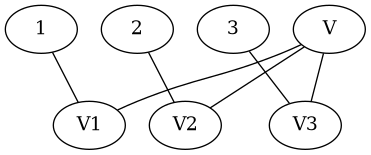

.. container:: document
   :name: function-concept-from-lattice-to-computing

   .. container:: section
      :name: pad-summary

      .. rubric:: Summary
         :name: summary

      This is a continuation of the blogs

      - `Information <http://rolandpuntaier.blogspot.com/2015/03/what-is-information.html>`__
        (2015)

        The basic concept of mathematics/physics is not the set, but the
        variable consisting of exclusive values (*variable/value*).
        Mathematics/physics is about
        `information <http://rolandpuntaier.blogspot.com/2015/03/what-is-information.html>`__
        encoding/processing and the variable is the smallest entity
        containing/conveying information. A set consists of variables,
        normally bits ("there" or "not there").

      - Formal Concept Analysis
        `FCA <http://rolandpuntaier.blogspot.com/2015/06/fca.html>`__
        (2015)

        Concepts in
        `FCA <http://rolandpuntaier.blogspot.com/2015/06/fca.html>`__
        are a dual
        `topology <https://en.wikipedia.org/wiki/Topology#Topologies_on_sets>`__,
        once using extent (objects, locations), once using intent
        (attributes, values). There is a `Galois
        connection <https://en.wikipedia.org/wiki/Galois_connection>`__
        between them. Intent and extent together form nodes arranged in
        a concept
        `lattice <https://en.wikipedia.org/wiki/Lattice_(order)>`__.

      - `Evolution <https://rolandpuntaier.blogspot.com/2019/01/evolution.html>`__
        (2019)

        In the
        `evolution <https://rolandpuntaier.blogspot.com/2019/01/evolution.html>`__
        blog a system consists of subsystems (of variables). Energy is
        the rate of information processing (value selections):
        *E* = Δ\ *I* ⁄ Δ\ *t*. The variable is the smallest entity
        having energy. Systems are layered. Every layer has its own
        energy unit. A subsystem has inner energy. All dynamical systems
        (natural evolution, economics, society, brain, computing, ...)
        can be described this way.

      In this blog, the formation of structure to save information leads
      to functions and function applications (computing) according
      `lambda
      calculus <https://en.wikipedia.org/wiki/Lambda_calculus>`__. When
      describing a concept lattice with functions (higher concepts), a
      function/variable is an uplink, a value a downlink (data,
      attribute).

      Statistically a function can be described as multivariate
      probability distribution. The probability distribution describes
      how often the function occurs, i.e. how much information is saved
      by the separation of structure into a separate function. The
      probability distribution is the view (distance) from the
      function/variable to the usage locations. The dual view is that
      from a location to the functions, which is Bayes Theorem
      *p*\ (*x*)\ *p*\ (*x*\ \|\ *y*) = *p*\ (*y*)\ *p*\ (*y*\ \|\ *x*).

      This blog also expounds using physical language, because every
      dynamic system is basically a computer. Physics has a language
      applicable to all dynamic systems. Dynamic systems produce
      functional structures just like software developers produce
      functions.

      .. admonition::

         Note

         high = concrete or abstract

         Concept lattices traditionally have the abstract nodes further
         up. Uplinks are links to more abstract nodes and downlinks the
         opposite.

         Normally though more concrete concepts are referred to as
         higher (e.g. OSI layers). The context hopefully makes it clear
         what is meant.

   .. container:: section
      :name: pad-computing

      .. rubric:: Computing
         :name: computing

      .. container:: section
         :name: pad-concept-lattice

         .. rubric:: Concept Lattice
            :name: concept-lattice

         From a power set, variables arise via (co-)incidence produced
         by inputs (objects, location). In
         ``{``\ ``{{1},{I``\ ````\ ``walk}},{{2},{I``\ ``run}} }``,

         - ``I`` is the invariant
         - that produces the variable consisting of the values
           ``{walk run}``

         ``I`` creates a local choice: the variable. ``I`` is by itself
         a value, but the change to the next value is slower.

         Slower variables

         - channel the selections to local variables
         - are a context to local variables

         ``run`` and ``walk`` exclude each other. In formal concept
         analysis
         (`FCA <http://rolandpuntaier.blogspot.com/2015/06/fca.html>`__)
         this exclusion is not yet there. A context in FCA is the
         incidence table, i.e. a binary there/not there, of

         - objects (extent), normally as rows, and
         - attributes (intent), normally as columns

         One does a union of objects to intersect attributes of. This
         results is a lattice of concepts, where the binary variables of
         the incidence results in larger variables, i.e. where more
         values exclude each other.

         The incidence table maps attributes to objects (*A*\ ’ = *O*)
         and objects to attributes *O*\ ’ = *A*. *A*\ ’’ is called a
         *closure*.

         A concept consists of

         - objects (extent) sharing the
         - same attributes (intent).

         The concepts in the lattice have a partial order produced by
         containment.

         More abstract concepts are

         - larger by extent (usage)
         - but smaller by intent (attributes)

         than more concrete concepts.

         The two orders are said to be dual. The extent marks importance
         and is used here.

         In FCA more abstract concepts are drawn further up.

         - A node above figures as value (join)
         - A node below figure as location (meet)

         This is against other fields, like the OSI layers in computer
         networking, where simpler concepts are drawn further down and
         said to be low level. The order people are used is that of
         space complexity, i.e. number of variables, not the number of
         usages (extent).

         So here higher means more concrete, further up, and lower means
         more abstract, or further down.
         ``{{1``\ ``2},{I}}``\ ``<``\ ``{{1},{I``\ ``walk}``, because
         ``{I}`` `⊂` ``{I walk}``. ``{{1},{I``\ ``walk}}`` and
         ``{{2},{I``\ ``run}}`` cannot be compared.

         One can cut away the most abstract part (filter) or the most
         concrete part (ideal) and still have a lattice.

         Every downlink is motivated by an uplink and vice versa.

         - One downlink meeting with more uplinks is a variable with
           attributes as values (uplinks are also called attributes).
           Different values produce different locations (more concrete
           objects).
         - Dually, one uplink joining with more downlinks is a variable
           with locations as values. This makes the locations the
           attributes and the attribute the location (understanding by
           location the focus of attention).

         The concept lattice uncovers variables.

         .. container:: figure
            :name: pvariable

            |variable.png|
            `Figure 1 <#pvariable>`__: The variable maps values to
            locations.

         Before starting to describe a concept, one must be able to
         distinguish values, like seeing color instead of just degrees
         of black and white, or seeing "color green" separate from
         "position here".

         Excluding values are variables already in the real system. A
         processor can detect a variable via an exclusiveness in a
         common context, i.e. a common parent node in the concept
         lattice.

         Exhaustiveness of a variable refers only to the available data.

         In the FCA there is no information/freedom like there is no
         freedom in an image. The freedom arises when a thread follows
         the links between nodes. Every local context of the thread
         opens a variable (way to continue the path).

         uplinks are AND-links
            Further Down, more concrete concepts combine further up
            concepts, i.e. link upward.
         downlinks are OR-links:
            Further up, more abstract concepts link down to alternative
            more concrete locations where they occur.

         The OR is exclusive by location and time. OR-links form a
         variable in the sense, that location represents the focus of a
         thread:

         - selection of a value/location by one thread represents one
           time
         - selection of a different value/location represents a
           different time

      .. container:: section
         :name: pad-function-lattice

         .. rubric:: Function Lattice
            :name: function-lattice

         One can express the concept lattice as lattice of sub-lattices,
         if one has

         - intersection of sub-lattices (abstraction)
         - union of sub-lattices (application)

         Structure becomes a value, to be recognised as a location
         (value).

         The common structure can be separated by introducing variables
         with values representing the change between locations
         (abstraction).

         The locations where the same structure is used is re-created by
         application. In the application variables are united with the
         values. This turns out to overlap with `lambda
         calculus <https://en.wikipedia.org/wiki/Lambda_calculus>`__.

         .. container:: formula

            *N* = (*λx*.\ *M*)\ *V*

         - M is abstraction of N
         - N is application of M

         The variable is added to the left (right-associative). This way
         existing applications of N stay as is: NW=(λx.M)W

         - application is left-associative
         - abstraction is right-associative

         A function is a structure that meets values of one or more
         variables to produce locations: each value combination one
         location.

         A variable alone is a special case of a function: A variable is
         a function that maps its values to locations. A variable is a
         coordinate function. A function is coordinate system.

         Dual view:

         - function maps a value to a new locations
         - value maps a function to a new locations

         The function encodes the information of the (full) cycle of
         values, normally of several variables. A function that keeps
         only one argument variable *is* a variable, i.e. the other
         variables represent the function.

         In programming the actual coding how to reach a location is
         done in function. The function can be called covariant, i.e.
         representing the complexity. The values are then the
         contravariant parts. In physics the unit is the covariant part,
         while the number value (magnitude) is the contravariant part,
         to reach a location.

         A function application unites (=AND's) variables with values to
         form locations by

         - position, mapping ordered parts to ordered parts (matrix
           method)
         - name, mapping concept to concept containing the same name
         - pointing name (address)

         In a computer with constant clock rate, the time for a
         selection depends on the structure that channels the clock's
         selections.

         A variable is motivated by an invariant (called symmetry in
         physics), which hints to a slower variable, of which the
         invariant is one value. The invariant marks a fixation to a
         more or less temporary location, which focuses the clock (the
         energy) to the local values. A variable reduces clock cycles
         (energy consumption).

         Functions are a way to organize selections.

         - Abstraction is compression. Less information needs less
           selection, i.e. less energy
         - Application is (re)creation (synthesis).

         In the concept lattice, the number of variables increase
         downward. Every variable adds information.

         If the information of a variable does not overlap with that of
         other variables, it is *orthogonal*.

         *n* orthogonal variables, with *v* values each (log\ *v*
         information), create *v*\ :sup:`n` combinations (*n*\ log\ *v*
         information). Such variables of same kind are a method of
         abstraction. Not all value combinations are actually used. They
         are *channel* variables that can accommodate all kind of
         information. Channel variables allow a general intermediate
         description with

         - encoding to it and
         - decoding from it

         Selections in more concrete layers take longer, if details need
         to be considered. If details are of no relevance
         (encapsulated), then the selection rate can also be the base
         rate (c).

         A description with more concrete concepts can be seen as domain
         specific language (*DSL*). A DSL can be embedded in a general
         purpose language via a library.

         Channel variables can also be introduced in a concrete layer to
         create a multitude of value combinations of e.g. digits or
         letters, mappable to concrete concepts.

         Such names are used in traditional programming languages (via
         numbers for indices and names for identifiers), in continuation
         of the language our social brain has developed during
         evolution.

         The names can be translated to other types of links, including
         matrix operations in simulated neural networks.

         The time to the next location is the link cost. It is a measure
         of distance of the location (represented by a value) to the
         variable or function. The time can be coded as probability.

         The link cost depends on

         - kind (position, name, pointer)
         - parallel channels (parallel physically (wires, nerves),
           sequentially by bus)
         - sequential steps (path consisting of uplinks and downlinks)

         A register machine basically uses a pointing name. The memory
         address is the name. The link cost (access time) can still
         vary: Some variables are in registers, some in cache, some in
         RAM.

         Neural tissue is highly parallel. Simulation of neural networks
         is parallel to a certain extent because matrix computations are
         parallel via SIMD instructions.

      .. container:: section
         :name: pad-fca-and-nn

         .. rubric:: FCA and NN
            :name: fca-and-nn

         AI normally refers to information processing not completely
         controlled by humans. In traditional programs the freedom of
         self-adaptation lies in the value of predetermined variables
         and the use of pre-written functions. AI adds the capability to
         create autonomously its own concepts (subsystems). The level of
         AI is determined by how abstract and general the concepts
         become.

         Both FCA and NN

         - have algorithms that create a lattice, which contains
           containments, which produces sub-orders and finally higher
           lattices that use functions.
         - have as input things that go together, the data.
         - allow to automate the ordering and reuse of information, to
           find a shorter description to meet the training goals (the
           environment).

         FCA creates the lattice from below, on demand, starting with
         zero links, while NN creates the lattice from above, i.e. full
         connection, and reduces the connection via weight pruning after
         training with a lot of data.

         In FCA you need as much input (extent) as much intent
         (features, variables) you want to store. In NN you need a lot
         of more data to prune all unneeded links.

         In NN nodes are layered. NN starts with an array architecture.
         Given an array of channel variables as input, i.e. input with a
         lot of unused data, NN can be used to filter out the fetures of
         interest.

         In FCA the lattice is organized by containment. This can be
         described by NN layers with clustered weights over more layers.

         In an FCA lattice the nodes combine values with AND (⋅) links
         from above and with OR ( + ) links further downward, but not so
         much in layers as in NN, where layer *i* follows from layer *k*
         via *xⁱ* = *wᵢₖf*\ (*xᵏ*) + *bᵢ*. With the activation function
         *f*, neuron *i* becomes a binary variable. The weights *wᵢₖ*
         decide on the sources *xᵏ*, and the bias *bᵢ* decide on the
         coding of *xᵢ* to make FCA-like AND uplinks for the *xᵢ* node.

         FCA does not provide fast algorithms with hardware support, but
         FCA can be subsumed by NN. FCA can guide the choice of NN
         architecture.

         - both have input that mixes values of more variables
         - both create a map of the actual topology from more inputs
         - both encode the topology with links and not by closeness of
           weights and nodes (neurons).
         - both need more inputs to produce the map; NN via parallel and
           gradual steps of change, FCA via (sequential) non-gradual
           steps.
         - both require the features/variables beforehand; NN to choose
           training input and NN topology, FCA to choose the kind of
           input.
         - both need more layers to combine more features/variables to
           functional blocks

         The difference is how the links are usually created:

         - NN reduces links from dense. FCA builds links from zero.
         - NN adapts gradually using gradient of loss. FCA links are
           boolean: there or not, 1 or 0. Usually NN works with floats
           as weights for gradual change, but binary weights (as in FCA)
           are also possible in NN. (`Hopfield
           network <https://en.wikipedia.org/wiki/Hopfield_network>`__)
         - NN needs a loss function, which could be universal, though.
           FCA does without loss function.

      .. container:: section
         :name: pad-function-as-multivariate-probability-distribution

         .. rubric:: Function as Multivariate Probability Distribution
            :name: function-as-multivariate-probability-distribution

         General channel variables have general channel functions. This
         generalization reduces the dimensionality and allows a
         statistical treatment of variables.

         Information makes sense only for a variable/function.
         Information is the number of the values/locations excluding
         each other in time.

         As a value by itself has no information, the code length is
         that of the variable it belongs to.

         Code length is the number of unit variables (normally bits)
         whose combinations of values produce the same number of values.

         The function combines/encodes more locations/values. Depending
         on the encoding of the function the frequency of values will
         change. Still, the total code length for every value is that of
         the variable, i.e.
         *I* =  − Σ\ *p*\ :sub:`i`\ *log*\ (*p*\ :sub:`i`).

         Every occurrence gets the same energy by making the code for
         rare values longer:
          − (log\ *p*\ :sub:`i`) ⁄ Δ\ *t*\ :sub:`i` = Δ\ *I* ⁄ Δ\ *t* = *E*,
         where Δ\ *t*\ :sub:`i` = *N*\ Δ\ *t* ⁄ *N*\ :sub:`i`. The
         longer code for rare values can be seen as the distance of the
         locations of application from the function.

         Probability represents a view from a function to the locations
         of application. At the locations of application generally more
         values of different variables are united with the function to
         produce the application.

         The function's value combinations represent locations.

         The function calls lead to a multivariate probability
         distribution by summing the locations/values along some other
         variables into a count representing the function's time. Fixing
         the values for some variables of a function (currying), the
         probabilities for the free variables is a cut through the total
         probability distribution.

         In a concept lattice without memory limits there would be no
         need for a probability, because the address length would
         correspond to the code length resulting from the probability
         value. But with limited memory the probability is the
         function's view to the locations. The variable combination is
         the coordinate system of the function. A value combination
         (i.e. the application) allows to infer the location.

         A multivariate probability distribution is a statistical view
         for a coded function. Probability theory derives the
         distribution from the coded function. Statistics derives the
         distribution from data. They are connected via Bayes Theorem
         *p*\ (*x*)\ *p*\ (*x*\ \|\ *y*) = *p*\ (*y*)\ *p*\ (*y*\ \|\ *x*).

         The multivariate probability distribution represents one time
         and one particle because the value combinations are exclusive.
         If called by parallel threads the same function produces a
         separated probability distribution per thread.

         The particle will be most likely where the probability is
         highest, but it will also occasionally be where the probability
         is lowest. The probability is the result of summing over hidden
         variables, basically all variables around the location of
         function application.

         If all hidden variables were included, each value combination
         would be equally likely, because all frequencies would be the
         same. The frequency would be that of the processor that runs
         with a constant clock.

         Without the hidden variables the frequency is that of the
         calls. This frequency is associated to the function, i.e. to
         the whole probability distribution, and not to single value
         combinations (locations). It does not matter where the particle
         is located: the energy (information/time) is always the same or
         made the same by `entropy
         encoding <https://en.wikipedia.org/wiki/Entropy_encoding>`__.

         Equal probabilities corresponds to a good choice of function or
         a balanced coding (like balanced tree), i.e. a good choice of
         coordinate system. Equal probabilities is information
         maximization (`principle of maximum
         entropy <https://en.wikipedia.org/wiki/Principle_of_maximum_entropy>`__).
         Maximum entropy corresponds to well distributed energy.

   .. container:: section
      :name: pad-language

      .. rubric:: Language
         :name: language

      .. container:: section
         :name: id2

         .. rubric:: Language
            :name: language-1

         A processor needs a way to address its concepts. There are
         several ways to address concepts. Addresses are concepts
         themselves.

         The animal brain has neurons and synapses as low level
         language. This network is connected with the world through
         senses and it is enough to intelligently interact with it.
         Still, the human animal has further developed a more concrete
         language on top of it to better work together.

         The human language hierarchy is

         - byte-phoneme-glyph
         - names
         - addresses
         - concepts
         - ...

         Names are the smallest part of an address. A name selects a
         value from an internal variable. A number can be a name.

         The concept lattice needs a language to exist. A description of
         structure with a language *is* the concept lattice.

         The same concepts can be expressed using different languages

         - bus addresses in a register machine
         - synaptic paths in the brain
         - weights in a neural network (NN)

         One needs conversion *to and from* the internal language, to
         allow to transfer a system from one processor to another.

         A small low level, abstract vocabulary can be used to build
         higher level, more concrete, concepts.

         Concept libraries are identifiable and are negotiated to settle
         on a common vocabulary for communication.

      .. container:: section
         :name: pad-basic-language

         .. rubric:: Basic language
            :name: basic-language

         It took natural evolution several hundred millions of years to
         reach our level of intelligence. The brains had to develop
         along. It is also a question of hardware.

         Our proofed abstract language from mathematics and the
         principal understanding of what learning is (basically
         information compression) will show us a shortcut.

         Humans have developed an abstract language already. Humans can
         divide-and-conquer vertically and train modules to use their
         abstract language to describe more concrete things.

         With programming languages the programmer still needs to think
         of how to write the functions. The experience and abstractions
         developed over generations provides developers with abstract
         concept allowing them to describe all kind of system.

         Software modules are trained modules. The testing was their
         training. Pre-trained FCA or NN represent also such a module, a
         high level concept.

         More FCAs can be combined with AND and OR like any other
         values. Higher level concepts form a higher level language. To
         really understand and merge the concepts and possibly form
         other concepts that lead to a shorter description, the high
         level concepts need to be described with a common low level
         language. Then they can be compared and merged.

         It takes quite an effort to realize that two mathematical
         theories are equivalent, e.g. `Curry-Howard
         correspondence <https://en.wikipedia.org/wiki/Curry%E2%80%93Howard_correspondence>`__.
         One needs to find a common way to describe them, a common
         language. This is why mathematics develops a more and more
         abstract base language. A common base language avoids that it
         happens too often, that people spend their life developing a
         theory to realize it was there already.

         To do a similar job, an AI also needs to have the high level
         concepts in a common low level language. It is not only AND and
         OR, but also which value out of which variable, and how they
         are encoded into bits.

         For example to allow an FCA to reorganize functions of a
         program, it needs to have a common description of them, e.g.
         via their machine code.

      .. container:: section
         :name: pad-turing-complete

         .. rubric:: Turing-complete
            :name: turing-complete

         A dynamic system needs information and time. A computer needs
         memory and clock. The more clocks, the more subsystems.

         Where is the clock in the `Turing
         machine <https://en.wikipedia.org/wiki/Turing_machine>`__? It
         is the function, which can consist of sub-functions. A Turing
         machine has energy (information/time). A function has energy
         (information/time).

         To define the function as a map from all domain values to all
         codomain values in one time step is never reality. It is an
         abstraction of a subsystem with the time unit equal to the
         cycle time. When comparing more subsystems a common time needs
         to be used, which brings energy into play.

         A Turing-complete language needs to map to creation and
         reduction of subsystems i.e. mutation and selection. This way
         information flows. For actual creation and selection time is
         needed: a thread.

         The minimal
         `SKI <https://en.wikipedia.org/wiki/SKI_combinator_calculus>`__
         or rather SK is Turing-complete. SK corresponds to
         `boolean <https://en.wikipedia.org/wiki/SKI_combinator_calculus#Boolean_logic>`__
         AND (creation) and OR (selection).
         `iota <https://en.wikipedia.org/wiki/Iota_and_Jot>`__ (ι) is
         another minimal Turing-complete language.

         What a Turing-complete language can actually do depends on the
         amount of memory. How fast it can do it depends on the system's
         clock.

   .. container:: section
      :name: pad-information-and-energy

      .. rubric:: Information and Energy
         :name: information-and-energy

      .. container:: section
         :name: pad-variable

         .. rubric:: Variable
            :name: variable

         Mathematics is about information processing. Its foundation
         must hold information.

         A variable is a set of values that are

         - exclusive (one value at a time)
         - exhaustive (all values get their turn)

         A bit is the smallest possible variable.

         The variable is the foundation of mathematics. A set in the
         conventional sense can be a variable, if finite and an
         exclusive choice is added ( ∈ ).

         A set where intersection and union is possible is not a
         variable, it is rather a collection of parallel bit variables.
         The power set of all combinations is a variable (with 2^N
         values), if a combination of values is seen as its value.

         The information of a variable is the number of bits to produce
         the same number of values.

         .. container:: formula

            *I* = log₂\ *N*

         A variable has information. A value has no information.

         For a variable to persist in time the values must be selected
         in a cycle. When values are reselected the cycle is repeated.
         The cycle of selections of values is the variable. The cycle
         information is the variable information.

         All objects moving in a physical space were observed to cycle
         at some scale.

      .. container:: section
         :name: pad-infinity

         .. rubric:: Infinity
            :name: infinity

         Infinite/non-cycling variables do not exist other than as a
         counting cycle/loop with deferred stop in an information
         processor.

         An information processor is a dynamical system. All dynamic
         systems consist of cycles. The human mind is an example.

         Mind or processor shall mean a general information processor,
         including computers.

         A counter normally uses a hierarchical containment of loops
         producing different values that are combinations of values of
         lower variables, whose rate of change differs in a systematic
         way e.g. by position of e.g. digits, letters, phonemes, ...

         A counter mimics a general dynamic system with subsystems. A
         counter with a deferred stop is also a deferred amount of
         information processed.

         One can nest counters. ℝ is a nesting of two counters: size and
         precision. A 2 ∈ ℝ has an infinite counter on the precision
         axis the same way as every irrational number. A value of ℝ is
         an algorithm, a counter, a higher concept. A value of ℕ, ℤ or ℚ
         is not algorithmic.

         `IEEE754 <https://en.wikipedia.org/wiki/IEEE_754>`__ fixes the
         two stop conditions by fixing the information in fraction and
         exponent (precision and size) for hardware. In `arbitrary
         precision
         software <https://en.wikipedia.org/wiki/List_of_arbitrary-precision_arithmetic_software>`__
         one is more flexible: one can defer fixing the stop conditions
         to the point where actually used.

      .. container:: section
         :name: pad-probability

         .. rubric:: Probability
            :name: probability

         Probability counts time (times of occurrences).

         .. container:: formula

            *N* ~ 1 ⁄ Δ\ *t* ~ 1 ⁄ *p*

         The normalization of probability to 1 for one variable is a
         comparison of time units.

         Information is associated with the variable not the value. With
         just one variable type of *C* equally frequent values, its
         information is 1, just like it would be for the bit, but the
         unit is different, with the factor log₂\ *C* as unit
         conversion.

         If values have their own time and if it is squashed to the time
         unit of the variable, then the (average) information or entropy
         of the variable is

         .. container:: formula

            *I* =  − Σ\ *p*\ :sub:`i`\ log\ *p*\ :sub:`i`

         Note that this has included

         - time via *p*\ :sub:`i` and
         - space via log\ *p*\ :sub:`i` (information)

         This is information per time, which is energy. But the time
         unit is that of the variable. A variable with same number of
         values and same distribution, but high frequency cannot be
         distinguished from one with low frequency. Locally this is also
         not needed.

         Two variables with independent times have probability
         *p*\ ₁₂ = *p*\ ₁\ *p*\ ₂. This corresponds to a transition to
         the smaller of the two time units. The information becomes
         additive, which makes the energy additive.

         The
         `Kullback-Leibler-divergence <https://en.wikipedia.org/wiki/Kullback%E2%80%93Leibler_divergence>`__
         compares two probabilities on the same variable, one derived
         from data, one from theory (as seen from the function). The
         `Kullback-Leibler-divergence <https://en.wikipedia.org/wiki/Kullback%E2%80%93Leibler_divergence>`__
         is the difference in information (code length) between theory
         and observation.

         .. admonition::

            Note

            information = entropy

            Information describes both,

            - what can be known (the alternatives, entropy, the
              variable) and
            - and what is known (the value).

            A system that does not change or has no alternatives has no
            information. A value alone has no information. The
            alternatives are the information.

      .. container:: section
         :name: pad-energy-information-time

         .. rubric:: Energy = Information / Time
            :name: energy-information-time

         Information alone entails time, because the values (selections)
         need time. Without values no variable and thus no information.

         .. container:: formula

            *E* = *I*

         A time step is a selection (value). Time does not exist between
         selections in the absence of another selection to provide a
         clock. When there is another selection to compare to, one gets
         a unit to compare to.

         Energy is the comparison of information with another
         information. Time is the unit of information. Energy is
         information expressed in the unit of time.

         With fixed information step *h* time and energy are inversely
         proportional:

         .. container:: formula

            Δ\ *E* = *h* ⁄ Δ\ *t*

         This is like with any physical quantity: unit and number value
         are inversely proportional.

         Energy is the differential view on information, and information
         is the integral view on energy.

         .. container:: formula

            *E* = (\ *dI*\ )/(\ *dt*\ )

         One always compares information with information. Time is a
         variable and thus information, too.

      .. container:: section
         :name: pad-layers

         .. rubric:: Layers
            :name: layers

         Interaction have their own time on a higher layer. In the power
         *P* = *dE* ⁄ *dτ* = *kd*\ ²\ *I* ⁄ *dt*\ ², the *τ* is the time
         of the higher layer and *E* and *t* are the inner energy and
         time of the subsystem. *P* by itself is also an energy, but on
         the next higher layer. When using the same time unit, then
         every layer adds a power of time rate

         - one layer (variable): *E* ~ *ν*
         - two layer *K* ~ *v*\ :sup:`2`
         - three layers *B* ~ *ν*\ :sup:`3` (Planck law)

         With according parallel independent processes, the expressions
         shift to the exponent.

         In thermodynamics, temperature *T* is a unit of energy

         .. container:: formula

            Δ\ *E* = *T*\ Δ\ *S* = (∂\ *E*)/(∂\ *S*)Δ\ *S*

         i.e. one splits the information into two layers, but keeps one
         time (the motion of particles gives the base clock for
         thermodynamic processes).

         Temperature more generally is the energy (information flow)
         between subsystems. The subsystems change because of the gain
         or loss of information.

         If the system as a whole looses energy certain structures
         settle in and stay for a longer time. This *structural cooling*
         reduces the dimension (number of variables), which reduces the
         information and frees it to the surrounding (e.g. `exergonic
         reaction <https://en.wikipedia.org/wiki/Exergonic_reaction>`__).

      .. container:: section
         :name: pad-one-time-more-variables

         .. rubric:: One Time - More Variables
            :name: one-time---more-variables

         The variable implies time, but

         - more variables in the observer system
         - can be one variable with one time in the observed system

         A coordinate system in mind might split a variable into more,
         which in reality are simultaneous. In mind the variables can be
         processed separately, but if a description of reality is aimed
         at, it needs to consider that the real variable consists of
         value combination.

         A general transformation between systems can be described by
         the
         `Jacobian <https://en.wikipedia.org/wiki/Jacobian_matrix_and_determinant>`__
         *J*\ ₂₁, where the combination of variables of system 1 and 2
         form a 2D matrix. One can expand the variables to values and
         work with a 3D matrix, but the other way around introduces
         functions that code structure. The matrix elements are
         impulses, which, if zero, describe an invariant.

         Functions can be non-linear, but non-linearity can also be
         described by more linearly coupled systems:

         .. container:: formula

            *n* = *J*\ :sub:`n\ (n − 1)`...\ *J*\ :sub:`32`\ *J*\ :sub:`21`\ 1

         A *J*\ :sub:`ji` corresponds to a layer of a Neural Network
         (NN).

         Time comes into play when describing all the system variables'
         rates relative to a third one's rate. The third variable is
         arbitrary and the mapping to the independent clocking of
         selections of system variables is necessarily imprecise.

         The Δ\ *t* of the observer clock is external, but assumed
         constant, while the information is inherent to the system.
         Energy conservation for a closed system says that the
         *information of the system is conserved*. A closed system is
         only locally closed, though. Non-closed cycles loose or gain
         information per time, i.e. energy.

         An invariant binds variables and makes their values to value
         combinations.

         A mind normally has an internal clock. What is invariant to its
         internal clock matters when describing the external system's
         information with the internal. What is invariant to the
         internal clock is one value combination. The according
         variables become dependent.

         Formation of dependent variables is a reduction of dimensions.

         The relation of the values in the value combinations can be
         described with functions.

         A function is a reused subsystem (invariant
         sub-concept-lattice) to create dependence between variables. A
         variable itself is a special function. The variable is the
         smallest fixation: just one invariant that all values share. A
         value is what is different at a location of function
         application.

         A subsystem of dependent variables with one time is called
         *particle* in physics and *thread* in computing.

         The order of selection produces a distance. Since a variable
         needs to cycle, the first value needs to follow the last one.
         One variable (dimension 1) cannot create a cycle. Two variables
         form a minimal particle or thread.

         Interaction between (processing of) particles form a higher
         layer, and need additional variables there. Three dimensions
         are minimal to have separate times (parallel processing). The
         actual number of dimensions is very dependent on the system.

         Independent particles have independent

         - information *I*
         - time *t*
         - energy *E*

         at every layer.

         In a layered system, containment channels energy of a
         thread/particle

         - to spread into lower particles (log) or
         - to accumulate from lower particles (exp)

      .. container:: section
         :name: pad-channel-variable

         .. rubric:: Channel Variable
            :name: channel-variable

         Flexible variables for general usage are called *channel
         variables* in this blog.

         Examples of channel variables are the pixels of a screen or the
         receptors on the retina.

         The information capacity per time of the channels needs to be
         higher than the actual information sent per time. The quotient
         Δ\ *I* ⁄ Δ\ *t* matters:
         Δ\ *I*\ :sub:`s` ⁄ Δ\ *t*\ :sub:`s` > Δ\ *I*\ :sub:`c` ⁄ Δ\ *t*\ :sub:`c`.
         Information per time is energy *E*. One can say the "energy of
         the channel" instead of `channel
         capacity <https://en.wikipedia.org/wiki/Channel_capacity>`__,
         which is the maximum of `mutual
         information <https://en.wikipedia.org/wiki/Mutual_information>`__,
         i.e. the maximum entropy by which the input and output
         probabilities are still dependent on each other.

         Non-binary variables with *C* values need log\ *C* binary
         channels. By doubling the frequency of a channel compared to
         e.g. the processor, the number of bus lines can be halved
         without energy loss. Else reducing lines reduces energy.

         - Our senses are channel variables.
         - The phonetic multitude of a natural language are a channel.
         - Data types are channels.
         - Numbers in mathematics are a flexible arbitrary width
           channel.

         Higher dynamic systems have channels to exchange subsystems
         that encapsulate energy.

         Some life on earth has evolved brains with algorithm that can
         decode from sensory input channels to the actual variables of
         origin.

         The mind is a dynamic system, that controls more energy than it
         consumes, by simulating higher energy interactions with lower
         energy interactions. Such `Maxwell
         demons <https://en.wikipedia.org/wiki/Maxwell%27s_demon>`__ are
         ubiquitous, but do not work any more if both systems use the
         same energy encapsulations.

         Evolution is search, i.e. trial and error or mutation and
         selection. Structural evolution needs to invent and prune
         structures, i.e. concepts, to reach a description short in
         space and/or time, to reduce the information per time, i.e. the
         energy.

         By exchanging more concrete concepts one needs less time than
         by using low concepts, because the concepts are there already
         in each interlocutor, they just need to be selected.

         This is also the case in the physical world. A kilo of petrol
         contains more energy than a kilo of current technology
         batteries, but the exchange in both cases takes the same amount
         of energy.

         The channel capacity depends on what is sent, on the protocol,
         and thus on sender and receiver. Channel capacity can be
         increased by

         - compression-decompression
         - memory and recall of memory
         - high level concepts

         Given a fixed energy low level channel like the phonemes of
         humans, there are still the protocol levels above, like the
         many-layered human concepts. On a computer, transporting HTML
         needs less channel energy than a pixel description of the page.

         A brain or computer has a more or less constant energy (=
         processing = communication of information per time). Using
         abstract concepts takes more time. Someone who tries to
         understand, i.e. compare the abstract language, is slower. In
         that time more physical energy is consumed, because what flows
         on the lowest physical level is physical information.

         More brain energy consumption in humans was made possible,
         because by broadening the sources, by becoming a generalist,
         also more energy became available. A species is a channel by
         itself. Ecosystems are channel systems that structurally evolve
         over time.

         The complexity of a language and the complexity of world it
         describes are covariant. Humans evolved intelligence because
         they were living in a complex world already.

      .. container:: section
         :name: pad-physical-function

         .. rubric:: Physical Function
            :name: physical-function

         Physically a function is a invariant structure (invariant
         meaning with a lower rate of change). This structure stays the
         same, while some values change. The structure channels
         information into local cycles. Local cycles need less
         information with equal clock.

         The structure leads to the selection of the next location with
         new impulse and new value. A function can be seen as the
         impulse itself. Processing (impulse) and value are alternating.

         The phase space volume of the particle/thread is the
         information summing both independent changes: that of the
         impulses (functions) and that of the value(s). Basically phase
         space volume just counts the locations traversed by the thread.
         Every location is a function application, a time step. So the
         phase space volume is equal to the time, but with a separate
         time unit one gets:

         .. container:: formula

            *E* = *I* ⁄ *T*

         The energy of a thread/particle is the phase space volume *I*
         per cycle time.

         This corresponds to the average information per average time
         step Δ\ *I* ⁄ Δ\ *t* of a value selection.

         In time stretches smaller than the cycle the actual selection
         time of a value and its local/space extend are inversely
         proportional (contravariant) to keep the constant energy of the
         particle. The function can be seen as curvilinear coordinate
         system.

         Time is defined by the sequential processing of a function.
         Exclusiveness of values refers to a location of application,
         representing a time step.

         In physics, specifying a functional relation, corresponds to
         the transition from the Lagrangian to the Hamiltonian, where
         the former assumes independent particles
         (*E* + *E* = *E* − *V*) and the latter one particle, i.e. one
         time (*E* + *V* = *H* = Constant).

      .. container:: section
         :name: pad-function-time-complexity

         .. rubric:: Function Time Complexity
            :name: function-time-complexity

         A function maps input to output. It works as a channel. One can
         associate an energy to it

         .. container:: formula

            *E* = *h* ⁄ Δ\ *t* = *hν*

         - *ν* is (processing) rate (speed)
         - *h* is (processed) information (memory)

         Both can be predetermined (register width, fix clock rate), or
         a result of runtime adaptations (parallelization / number of
         synapses / NN links, dynamic clocking), but normally they stay
         constant over some more or less local time.

         A processor has basic variables and functions with their
         according *E*. The execution time of a higher function is the
         sum of that of lower functions.

         As a result in the containment hierarchy of functions every
         function has got its processing energy, which depends on the
         (underlying) structure and the lowest level processing energy.

         The processing energy corresponds to the
         `big-O-notation <https://en.wikipedia.org/wiki/Big_O_notation>`__
         of time complexity. In *O*\ (*f*\ (*n*))

         - *f*\ (*n*) is number of time steps depending on the size of
           the input. The reflects the layering, i.e. the structure, of
           the processing.
         - *ν* = 1 ⁄ Δ\ *t* is replaced by the big *O*, because it
           depends on the varying system clock and access strategies of
           systems

         .. container:: formula

            *E* = *O*

         A processor can process limited, normally constant, information
         per time. Processing energy is shared between parallel threads.
         Threads can be halted or their atomic operations can be of
         variable duration. Parallel threads have separate times.

         Evolution of a processor (HW+SW) and its functions goes towards

         - a higher *E* on the supply side
           (computers/processors/functions become more powerful)

           For functions:

           - *cache* arguments (currying): - *h* up due to caching - *ν*
             up due because no need to supply argument
           - *memoization*:

             - *h* up due to the map
             - *ν* up due to shortcutting input to output via direct
               mapping

         - a lower *E* on the demand side (information is compressed to
           save computing power)

           For functions: *generate* arguments on demand.

           - *h* down since no caching
           - *ν* down due to needed calculations to supply arguments

         In a function with constant *E*, *h* and *ν* are inversely
         proportional (contravariant).


